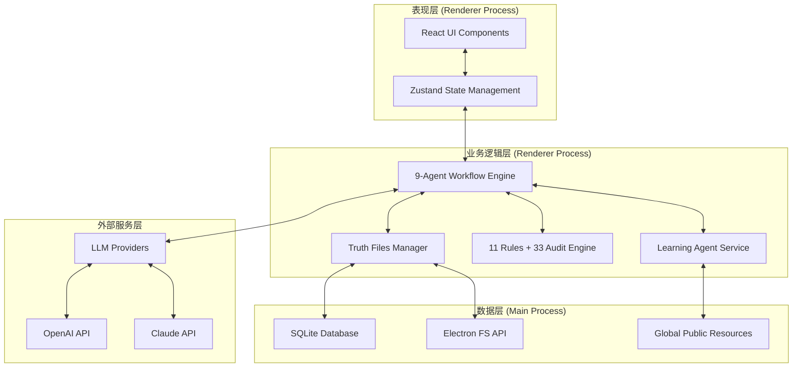
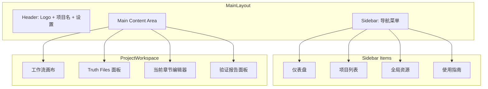

# Novel Creation Kit Desktop - 项目规格说明书

**版本**: V1.0

**创建日期**: 2026-03-28

**核心定位**: 基于 Electron 的多智能体小说创作桌面应用，将 InkOS 设计理念的 9-Agent 协作系统、7 个 Truth Files 和 33 维度审计完整移植到桌面端，提供流畅的可视化创作体验。

---

## 1. 项目概述

### 1.1 背景

Novel Creation Kit v3 是一个基于 InkOS 的多智能体小说创作系统，原为命令行工具。本项目将其重构为功能完整的 Electron 桌面应用，让用户可以在本地电脑上高效地进行工业化小说创作。

### 1.2 核心功能

- **9-Agent 协作工作流**: 可视化展示档案员 → 文风师 → 编剧 → 写手 → 字数管控师 → 润色师 → 验证官 → 修订师 → 学习代理的完整流程
- **7 个 Truth Files 可视化管理**: current_state、resource_ledger、pending_hooks、chapter_summaries、subplot_board、emotional_arcs、character_matrix
- **11 条硬规则实时检查**: 写后验证器集成，零 LLM 成本自动检查
- **33 维度审计系统**: 全方位质量保障体系
- **多 API 支持**: 集成 OpenAI、Claude 等多种 LLM 提供商
- **全局公共资源库**: 类型化学习资产、用户偏好画像

### 1.3 目标用户

- 网文创作者（无限流、玄幻、都市等）
- 个人小说作者
- 有工业化创作需求的写作团队

---

## 2. 技术架构

### 2.1 技术栈

| 层级 | 技术选型 | 说明 |
|------|---------|------|
| 桌面框架 | Electron 28+ | 跨平台桌面应用框架 |
| 前端框架 | React 18 + TypeScript | 组件化 UI 开发 |
| 状态管理 | Zustand | 轻量级状态管理 |
| UI 组件库 | Ant Design 5 | 企业级 React 组件 |
| 本地存储 | SQLite + better-sqlite3 | 项目数据持久化 |
| 文件系统 | Electron fs API | Truth Files 读写 |
| LLM 调用 |LangChain.js | 多 API 统一封装 |
| 构建工具 | Vite + electron-builder | 快速构建打包 |

### 2.2 系统架构图



### 2.3 目录结构

```
novel-creation-kit-desktop/
├── electron/
│   ├── main.ts                 # Electron 主进程
│   ├── preload.ts              # 预加载脚本
│   └── services/
│       ├── database.ts         # SQLite 数据库服务
│       ├── fileSystem.ts       # 文件系统服务
│       └── llm/
│           ├── index.ts         # LLM 工厂
│           ├── openai.ts        # OpenAI 提供者
│           └── claude.ts       # Claude 提供者
├── src/
│   ├── main.tsx                # React 入口
│   ├── App.tsx                 # 应用根组件
│   ├── components/
│   │   ├── layout/
│   │   │   ├── MainLayout.tsx
│   │   │   ├── Sidebar.tsx
│   │   │   └── Header.tsx
│   │   ├── workflow/
│   │   │   ├── WorkflowCanvas.tsx
│   │   │   ├── AgentCard.tsx
│   │   │   └── WorkflowControls.tsx
│   │   ├── truthFiles/
│   │   │   ├── TruthFilesPanel.tsx
│   │   │   ├── CurrentStateEditor.tsx
│   │   │   ├── PendingHooksEditor.tsx
│   │   │   └── CharacterMatrixEditor.tsx
│   │   ├── validation/
│   │   │   ├── RuleValidator.tsx
│   │   │   └── AuditReport.tsx
│   │   └── settings/
│   │       ├── SettingsDialog.tsx
│   │       └── ApiConfig.tsx
│   ├── pages/
│   │   ├── Dashboard.tsx
│   │   ├── ProjectList.tsx
│   │   ├── ProjectWorkspace.tsx
│   │   └── GlobalResources.tsx
│   ├── stores/
│   │   ├── projectStore.ts
│   │   ├── workflowStore.ts
│   │   └── settingsStore.ts
│   └── utils/
│       ├── ipc.ts              # IPC 通信封装
│       └── validators.ts       # 验证规则
├── public_resources/           # 全局公共资源库
│   ├── public_learnings/
│   │   ├── 全类型通用学习库/
│   │   └── 分类型专属学习库/
│   └── public_standards/
├── tools/                       # Python 验证工具 (bundled)
├── package.json
├── vite.config.ts
├── electron-builder.yml
└── tsconfig.json
```

---

## 3. 功能模块设计

### 3.1 项目管理模块

#### 3.1.1 项目列表页

| 功能 | 描述 |
|------|------|
| 项目卡片展示 | 显示项目名称、类型、创建时间、创作进度 |
| 新建项目 | 创建新小说项目，选择类型（无限流/玄幻/都市/科幻/悬疑） |
| 删除项目 | 确认后删除，包含备份 |
| 搜索过滤 | 按名称、类型、状态搜索 |

#### 3.1.2 项目创建流程

1. 输入项目名称
2. 选择小说类型（自动加载对应类型的全局资源）
3. 选择是否从模板创建
4. 初始化 Truth Files

### 3.2 工作流引擎模块

#### 3.2.1 9-Agent 协作可视化

| 组件 | 功能 |
|------|------|
| WorkflowCanvas | 展示 9 个 Agent 的工作流程，支持拖拽查看详情 |
| AgentCard | 显示每个 Agent 的状态（待执行/执行中/完成/失败）、当前任务 |
| WorkflowControls | 控制工作流：开始、暂停、重置、单步执行 |
| TaskPanel | 展开查看当前 Agent 的任务详情、输入输出 |

#### 3.2.2 Agent 状态流转

```
档案员 → 文风师 → 编剧 → 写手 → 字数管控师 → 润色师 → 验证官 → 修订师 → 学习代理
   ↓         ↓        ↓       ↓         ↓           ↓        ↓         ↓         ↓
 pending  pending   pending  pending   pending     pending   pending   pending   pending
   ↓         ↓        ↓       ↓         ↓           ↓        ↓         ↓         ↓
running   waiting   waiting  waiting   waiting     waiting   waiting   waiting   waiting
   ↓         ↓        ↓       ↓         ↓           ↓        ↓         ↓         ↓
completed running   waiting  waiting   waiting     waiting   waiting   waiting   waiting
   ↓         ↓        ↓       ↓         ↓           ↓        ↓         ↓         ↓
...       completed  ...     ...       ...         ...       ...       ...       ...
```

### 3.3 Truth Files 管理模块

#### 3.3.1 7 个 Truth Files

| 文件 | 功能 | 可视化组件 |
|------|------|-----------|
| current_state.md | 世界当前状态 | 状态卡片、时间线 |
| resource_ledger.md | 资源账本 | 表格编辑器、数值图表 |
| pending_hooks.md | 待处理伏笔池 | 看板视图、钩子列表 |
| chapter_summaries.md | 章节摘要 | 章节卡片、进度条 |
| subplot_board.md | 支线进度板 | 看板、进度指示器 |
| emotional_arcs.md | 情感弧线 | 折线图、弧线编辑器 |
| character_matrix.md | 角色交互矩阵 | 矩阵表格、关系图 |

#### 3.3.2 编辑器功能

- Markdown 可视化编辑
- 实时预览
- 版本历史对比
- 自动保存

### 3.4 验证审计模块

#### 3.4.1 11 条硬规则检查器

| 规则编号 | 规则内容 | 错误级别 |
|---------|---------|---------|
| R01 | 禁止"不是……而是……"句式 | Error |
| R02 | 禁止破折号"——" | Error |
| R03 | 转折词密度 ≤ 1次/3000字 | Warning |
| R04 | 高疲劳词 ≤ 1次/章 | Warning |
| R05 | 禁止元叙事 | Warning |
| R06 | 禁止报告术语 | Error |
| R07 | 禁止作者说教词 | Warning |
| R08 | 禁止集体反应套话 | Warning |
| R09 | 禁止连续4句"了"字 | Warning |
| R10 | 段落长度 ≤ 300字 | Warning |
| R11 | 禁止本书禁忌 | Error |

#### 3.4.2 33 维度审计

| 类别 | 维度数 | 说明 |
|------|-------|------|
| A类 | 8 | 基础一致性（OOC、战力崩坏、信息越界等） |
| B类 | 7 | 内容质量（词汇疲劳、利益链、台词失真等） |
| C类 | 5 | AI痕迹（段落等长、套话密度等） |
| D类 | 5 | 故事结构（支线停滞、弧线平坦等） |
| E类 | 3 | 合规（敏感词） |
| F类 | 2 | 番外专属（正传冲突、未来信息泄露等） |
| G类 | 3 | 读者体验（钩子设计、大纲偏离等） |

### 3.5 设置模块

#### 3.5.1 API 配置

| 配置项 | 说明 |
|-------|------|
| API 提供商 | OpenAI / Claude / 自定义 |
| API Key | 加密存储 |
| API Endpoint | 可自定义 endpoint |
| 模型选择 | 根据提供商显示可用模型 |
| Temperature | 0.0 - 2.0 |
| Max Tokens | 限制生成长度 |

#### 3.5.2 全局资源管理

- 查看全局公共资源库结构
- 导入/导出类型化学习资产
- 用户偏好画像查看与编辑

---

## 4. 数据模型

### 4.1 数据库 Schema (SQLite)

```sql
-- 项目表
CREATE TABLE projects (
    id TEXT PRIMARY KEY,
    name TEXT NOT NULL,
    type TEXT NOT NULL,
    created_at DATETIME DEFAULT CURRENT_TIMESTAMP,
    updated_at DATETIME DEFAULT CURRENT_TIMESTAMP,
    status TEXT DEFAULT 'active'
);

-- 章节表
CREATE TABLE chapters (
    id TEXT PRIMARY KEY,
    project_id TEXT NOT NULL,
    number INTEGER NOT NULL,
    title TEXT,
    content TEXT,
    status TEXT DEFAULT 'draft',
    created_at DATETIME DEFAULT CURRENT_TIMESTAMP,
    FOREIGN KEY (project_id) REFERENCES projects(id)
);

-- 创作记录表
CREATE TABLE创作_records (
    id TEXT PRIMARY KEY,
    project_id TEXT NOT NULL,
    agent_name TEXT NOT NULL,
    chapter_id TEXT,
    input TEXT,
    output TEXT,
    status TEXT,
    created_at DATETIME DEFAULT CURRENT_TIMESTAMP,
    FOREIGN KEY (project_id) REFERENCES projects(id)
);

-- 验证结果表
CREATE TABLE validation_results (
    id TEXT PRIMARY KEY,
    chapter_id TEXT NOT NULL,
    rule_id TEXT NOT NULL,
    severity TEXT NOT NULL,
    position INTEGER,
    description TEXT,
    suggestion TEXT,
    created_at DATETIME DEFAULT CURRENT_TIMESTAMP,
    FOREIGN KEY (chapter_id) REFERENCES chapters(id)
);

-- 设置表
CREATE TABLE settings (
    key TEXT PRIMARY KEY,
    value TEXT NOT NULL,
    updated_at DATETIME DEFAULT CURRENT_TIMESTAMP
);
```

### 4.2 文件系统结构

```
~/Documents/NovelCreationKit/
├── projects/
│   └── {project-id}/
│       ├── project.json
│       ├── truth_files/
│       │   ├── current_state.md
│       │   ├── resource_ledger.md
│       │   ├── pending_hooks.md
│       │   ├── chapter_summaries.md
│       │   ├── subplot_board.md
│       │   ├── emotional_arcs.md
│       │   └── character_matrix.md
│       ├── chapters/
│       │   ├── 第1章.md
│       │   └── ...
│       └── backups/
├── global_resources/
│   └── (全局公共资源库)
└── config.json
```

---

## 5. 界面设计

### 5.1 整体布局



### 5.2 页面清单

| 页面 | 路由 | 功能 |
|-----|------|------|
| 仪表盘 | / | 概览、快捷操作、最近项目 |
| 项目列表 | /projects | 项目管理 |
| 项目工作区 | /projects/:id | 核心创作界面 |
| 全局资源 | /resources | 公共资源库浏览 |
| 设置 | /settings | API 配置、应用设置 |

### 5.3 配色方案

| 用途 | 色值 | 说明 |
|------|-----|------|
| 主色 | #1890ff | 品牌色、主要按钮 |
| 成功 | #52c41a | 完成状态 |
| 警告 | #faad14 | 警告状态 |
| 错误 | #ff4d4f | 错误状态 |
| 背景 | #f5f5f5 | 页面背景 |
| 卡片背景 | #ffffff | 卡片、面板背景 |
| 文字主色 | #262626 | 主要文字 |
| 文字次色 | #8c8c8c | 次要文字 |

---

## 6. IPC 通信设计

### 6.1 主进程 API

| 通道 | 方向 | 功能 |
|------|-----|------|
| project:create | renderer → main | 创建项目 |
| project:list | renderer → main | 获取项目列表 |
| project:get | renderer → main | 获取项目详情 |
| project:delete | renderer → main | 删除项目 |
| file:read | renderer → main | 读取文件 |
| file:write | renderer → main | 写入文件 |
| file:backup | renderer → main | 备份文件 |
| llm:generate | renderer → main | 调用 LLM |
| validation:run | renderer → main | 运行验证 |
| audit:run | renderer → main | 运行审计 |

---

## 7. 打包与分发

### 7.1 构建配置

- **目标平台**: Windows (NSIS)、macOS (DMG)、Linux (AppImage)
- **应用图标**: 自动从 assets/icon.png 生成
- **自动更新**: 使用 electron-updater
- **代码签名**: 支持 Windows/macOS 代码签名

### 7.2 安装包结构

```
NovelCreationKit-Setup-1.0.0.exe
├── resources/
│   └── app.asar
├── locales/
└── uninstall.exe
```

---

## 8. 验收标准

### 8.1 功能验收

- [ ] 可以创建、打开、删除小说项目
- [ ] 9-Agent 工作流可视化正常展示
- [ ] Truth Files 可正常编辑和保存
- [ ] 11 条硬规则检查正常工作
- [ ] 33 维度审计报告正常生成
- [ ] 多 API 配置可正常切换
- [ ] 全局公共资源库可正常加载

### 8.2 性能验收

- [ ] 应用启动时间 < 3 秒
- [ ] 项目切换时间 < 1 秒
- [ ] 验证器处理 3000 字 < 1 秒

### 8.3 质量验收

- [ ] 无运行时崩溃
- [ ] 数据持久化可靠
- [ ] 窗口记忆功能正常
